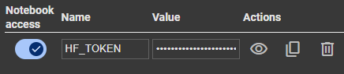
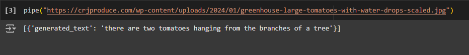
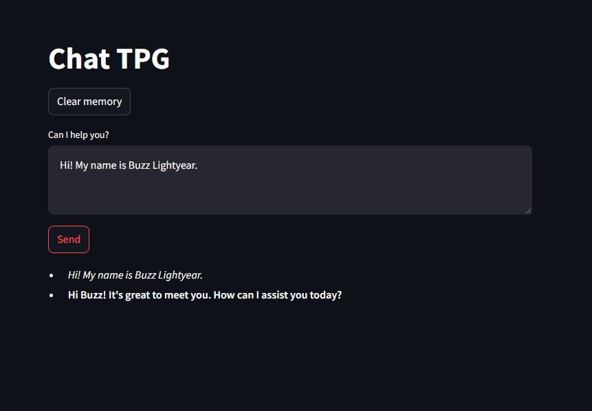
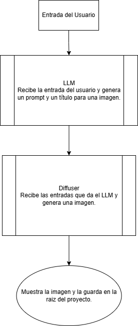
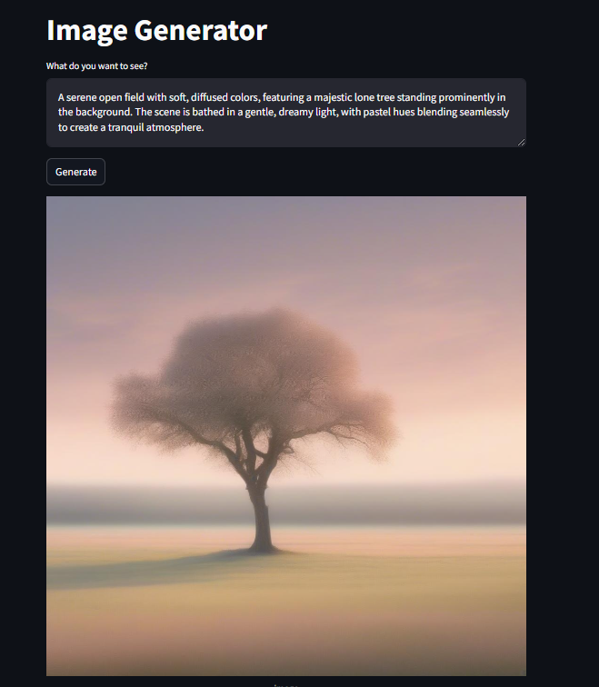

# 1. Cómo usar localmente un modelo

Para usar un modelo en local se puede usar **pipeline** que simplifica el uso de modelos preenrrenados. En este caso lo usaremos en colab.

En este caso usaremos [Salesforce/blip-image-captioning-large](https://huggingface.co/Salesforce/blip-image-captioning-large).

Este modelo tiene 470M de parametros y F32, esto quiere decir que se necesitan aproximadamente 1.88 GB de memoria.

$$
470000000 \times 4 \text{ bytes} \approx 1.88\text{ GB}
$$

Para usarlo en Google Colab agregar el token en las variables de entorno:



Luego instalar transformers para luego importar de ella pipeline.

```bash
pip install transformers
```

Se instancia pipeline con la tarea y el modelo que se utilizará:

```python
from transformers import pipeline

pipe = pipeline("image-to-text", model="Salesforce/blip-image-captioning-large")
```

Finalmente se usa la instancia del modelo con una imagen de prueba:

```python
pipe("https://crjproduce.com/wp-content/uploads/2024/01/greenhouse-large-tomatoes-with-water-drops-scaled.jpg")
```


_Imagen de prueba_

La respuesta del modelo en este caso es:



**[Notebook en Colab](https://colab.research.google.com/drive/1E3wcL_OjMrIyOJIXO6QoMdlE4jNZsO1q?usp=sharing)**

# _Consideraciones preeliminares para 2 y 3_

## Configuración

Este proyecto utiliza:

- Streamlit
- huggingface-hub
- python-dotenv

### Instalación del proyecto

Crear y activar un entrono virtual:

```bash
python -m venv env

env\Scripts\activate
```

Para instalar las dependencias se debe ejecutar en la terminal:

```bash
pip install -r requirements.txt
```

### Instrucciones para Variables de Entorno

Se debe crear un archivo .env con la API KEY de Hugging Face.

```bash
API_KEY="hf_xxxxxxxxxxxxxxxxxxxxxxxxxxxxxxxxx"
```

# 2. Chat mediante API

## Descripción

Este proyecto usa el modelo [Qwen/QwQ-32B-Preview ](https://huggingface.co/Qwen/QwQ-32B-Preview).

Esta aplicación contiene un archivo _messages.json_ que en principio contiene:

```json
[
  {
    "role": "system",
    "content": "You are an assistant who answers as briefly as possible."
  }
]
```

Esta es la instrucción que se le da al modelo a modo de sistema. En este archivo se guadan los mensajes enviados por el usuario y el modelo. De esta forma se logra que el modelo tenga "memoria". Un ejemplo sería:

```json
[
  {
    "role": "system",
    "content": "You are an assistant who answers as briefly as possible."
  },
  { "role": "user", "content": "Hi! My name is Buzz Lightyear." },
  {
    "role": "assistant",
    "content": "Hi Buzz! It's great to meet you. How can I assist you today?"
  }
]
```

## Instrucciones para ejecutar el proyecto

Para levantar el servidor por consola:

```bash
streamlit run app.py
```

## Uso de la aplicación

### Vista general



### _Recomendación_

_Antes de empezar hacer click en **Clear memory** para limpiar la memoria de conversaciones anteriores._

### Uso

Para usar el chat simplemente escribe un mensaje y haz click en **Send**.


# 3. Usando un modelo con tools

## Descripción

Este proyecto utiliza dos modelos [microsoft/Phi-3.5-mini-instruct](https://huggingface.co/microsoft/Phi-3.5-mini-instruct) y [stabilityai/stable-diffusion-xl-base-1.0](https://huggingface.co/stabilityai/stable-diffusion-xl-base-1.0?text=tree). Ambos son se usan en modo _serverless_ mediante la API de Hugging Face.

Para usarlos, el modelo de generación de imágenes es dado como herramienta al modelo de generación de texto. Así, cuando el usuario ingresa un texto, el LLM genera un título (solo para descripción) y un prompt que es pasado al otro modelo para que genere la imagen.

Esta es la documentación para la función que se usa como herramienta:

```python
{"type": "function",
         "function": {
             "name": "create_image",
             "description": "Generate an image based on a given text prompt.",
             "parameters": {
                 "type": "object",
                 "properties": {
                     "prompt": {"type": "string", "description": "The text description of the image."},
                     "title": {"type": "string", "description": "A title for te image"}
                 },
                 "required": ["prompt"]
             }
         }
         }
```

_El título no es obligatorio ya que la función tiene un valor por defecto en caso de que no se envíe._

Un breve diagrama de la aplicación:



## Instrucciones para ejecutar el proyecto

Para levantar el servidor por consola:

```bash
streamlit run app2.py
```

## Uso de la aplicación

### Vista general


### Uso

Para usar el chat simplemente describe tu imagen y haz click en **Generate**.


